# Grasssroots Field Trials tutorial

## Introduction

The [Grassroots Infrastructure](https://grassroots.tools) is a project to allow the sharing of both data and web services to work upon them in a [FAIR](https://www.go-fair.org/fair-principles/) way.
These can be accessed from web browsers using our user portal, through our mobile app, desktop client, command line or using one of the Application Programming Interfaces (API) that we support.
The data varies from biological sequences through to individual phenotype measurements within field trial experiments.
The services range from wrapping industry standard tools such as BLAST through to custom services _e.g._ dealing with Parental Genotypes of SNP markers. 
The focus of this lesson though is the service used to store [Field Trial](https://grassroots.tools/fieldtrial/all) data. 
These are experiments that can happen in the field or in a glasshouse where one or more lines of crops are planted, treatments applied and phenotypic measurements taken.

The standards we have produced follow the same concepts as the [Breeding API (BrAPI)](https://brapi.org/) which is a set of community-driven standards to make genotyping, phenotyping and trial data interoperable and reusable.

The top level of the BrAPI hierarchy is a _Programme_ which, initially for us, is the DSW programme. We also store non-DSW data and have other Programmes in the system, however our initial focus is on DSW data.

Each Programme can contain one or more _Trials_, which BrAPI defines as the equivalent of an _investigation_ in the [Minimal Information about a Plant Phenotyping Experiment (MIAPPE)](https://www.miappe.org/) standard.

Trials can consist of one or more experiments where seeds are sown and phenotypic information is gathered and each of these is called a _Study_. 
These contain a wide variety of data, such as weather information, experimental design notes, GPS data, _etc._ and each Study takes place at a _Location_. 
To add a Study to the system you need to define both the Field Trial that it is part of and the Location where it took place.

For each Study, you can specify the set of phenotypes that will be measured and these are called _Measured Phenotype Variables_. 
Each of these consists of unique triples (three distinct pieces of information) that define:

 * A phenotype
 * How it has been measured
 * Which units have been used

When you have specified the phenotypes to use, these are submitted as Plots, along with the details of how the experiment has been laid out in the field. 
Plots contain various details such as width, length, their position in the field, phenotypic data, _etc._

All of the uploaded data is available in our field trial search portal which allows you to search across all Studies and view individual Studies in more detail.

For further information please take a look at the [Field Trials user guide](https://grassroots.tools/documentation/field_trial/).

## Submitting a Study

In this tutorial, we are going to create a Study and upload it to a Grassroots demo server. 
We have various Programmes, Trials, Studies , Locations, _etc._ already in the system so we can use existing Programmes, Trials and Locations and focus instead on creating a new Study. 
This is done in two parts: Creating a Study and then uploading the Plots information. 
We will be doing this on our [Grassroots demo server](https://grassroots.tools/dev/fieldtrial/all). 

## Creating a Study

Studies have many potential items of metadata all available which are set using the form on the [Submit Study](https://grassroots.tools/dev/service/field_trial-submit_study) web page. 
Once you have opened that page you will be presented with a number of fields where you can enter data. 
Although there are lots of them, don't worry, most of them are optional and you can always save it and fill in the various pieces of metadata at a later time. 
The only fields that are initially required are 

 * The name of the Study
 * The Field Trial that it is a part of
 * The Location where the Study is taking place

These are set with the *Name*,  *Field trials* and *Locations* fields so let's start by setting those. 
Choose any name for your Study, ideally, make it a unique one so that it doesn't get confusing by having multiple Studies with the same name. 
Similarly, choose a Field Trial and Location by clicking on the list of available entries for each of these and selecting the ones that you would like.
For instance to create a Study called _Paragon lines_ as part of the _DSW Course Trial_ at _Football Field, Church Farm_ you would have something similar to:

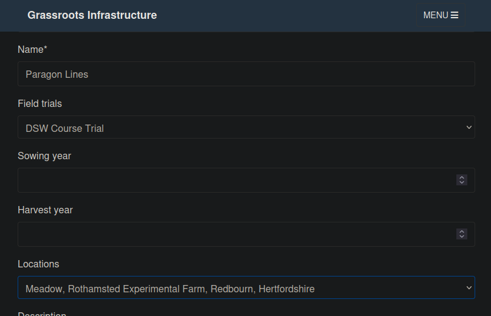

You can also scroll down the form to the *Crop* drop-down menu and choose _wheat_. 
So choosing whatever name you would like for the Study, scroll down to the bottom of the page and click on the _Submit_ button to save this initial version of the Study. 
Upon completion a link to view your study on the Field Trials portal will appear and clicking on this will take you to the initial version of your Study. 
If you click on this it can be left open in a separate browser window so that you can easily see the changes that you make.

Commonly people would come back to edit the Study at a later date rather than continuing straight away as we are doing here, so we need to make sure that we load our new Study rather than carrying on editing as we would then be creating another copy of this Study with an identical name. 
To stop this from happening, we just need to tell the system that we want to edit the Study we've just created and to do this, reload the page in your web browser and click on the drop-down menu for the *Load Study* option at the top of the page and choose your Study. 
The Studies are in alphabetical order and you can start typing in the name of your Study to jump to that point in the list. 
Once you've selected your Study, we can submit updated versions of the Study as many times as you like without having to refresh the page.

Now more of the metadata fields for your Study can be filled in.
You can hover over any of these and a help bubble will appear and there is further information on each of the different fields in the [Submit Study docs](https://grassroots.tools/documentation/field_trial/submit_study.html).
One field we will pay attention to is the *Plots GPS* field. 
This allows you to upload a GeoJSON file containing the geometry of all of a Study's Plots and see them in the map-based view within the Field Trials portal.
For example, the [Watkins mapping populations for yield, NUE and associated traits, RRes, Harvest 2019](https://grassroots.tools/fieldtrial/study/5f85593602700f5e9c10f6c7) Study is one that has GPS data and shows each of the Plots as a blue square. 
If you zoom in on the map and for the above Study and click on any of these, a pop-up with the information for the given Plot will be displayed as in the image below.

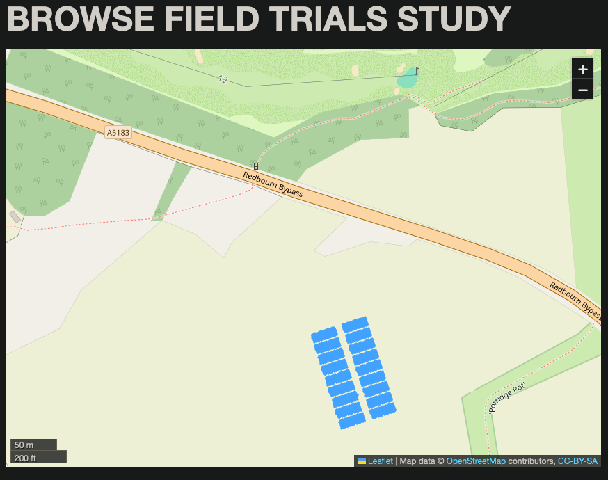

So the next stage is to add some GPS data to your Study and there is an [example GeoJSON file](example_plots.geojson) that you can download and save to your computer.
Once it's on your computer, if you scroll down to the *Plots GPS* field, you can drag and drop the file onto this field and it will read all of the file into this field to give you something like

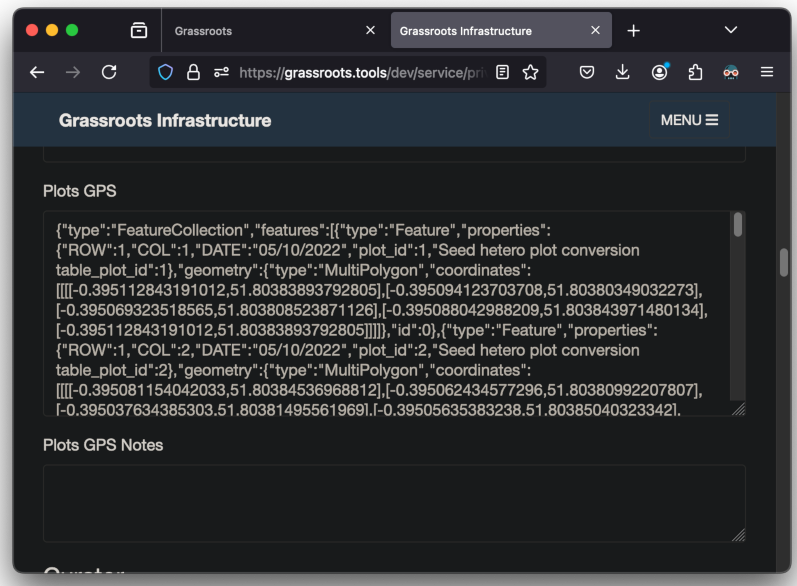

Click on the _Submit_ button to save the Study and then if you would like to see this in the map-based view, you can reload the Study's web page on the portal.

### Adding the treatments

Treatment Factors are metadata that specify pieces of information such as the level of Nitrogen fertilizer used on a given plot and these can be added as extra columns within the spreadsheet. 
As with the Measured Variables, Grassroots has many Treatments that have been defined within ontologies such as the [Plant Experimental Conditions Ontology](https://bioportal.bioontology.org/ontologies/PECO) and imported into Grassroots. 
In our example let's assume that in our Study, Nitrogen fertilizer was applied to the Plots within our Study at two different levels; 50kg n/ha and 200kg n/ha.
We are going to add the information about this for each of the Plots within our Study. 
The frst thing that we need to do is find the ontology term that defines the amount of Nitrogen fertilizer that is used. 
As before, in Grassroots, there is a [search service](https://grassroots.tools/service/field_trial-search_treatments) where you can search for the terms that you require.
So let us search for a term to specify the amount of Nitrogen fertilizer that has been used on each Plot. 
If you type _nitrogen_ in the search box, you should be presented with something similar to the screenshot below.

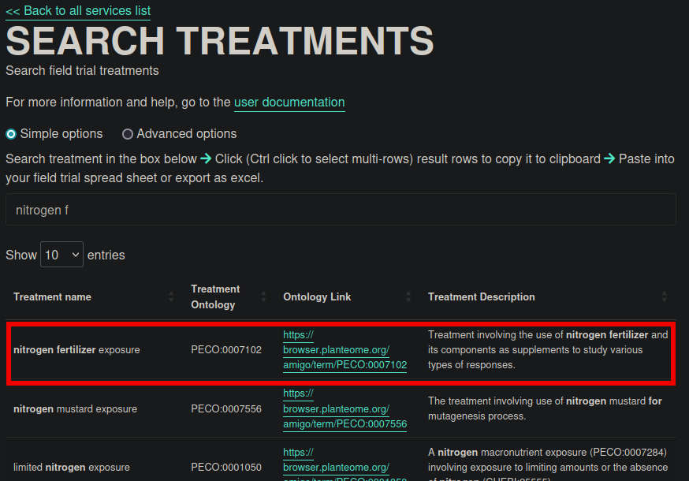

The term that we use as the column header in the Plots spreadsheet and to add to the list of the _Treatment Factors_ within the Study is the value specified in the _Treatment Ontology_ column in the search results, which in this case is PECO:0007102.

Now we can go back to the _Submit Field Trial Study_ page and scroll down to the section labelled *Treatment Factors*. 
This is where specify the Treatments that occur within the Study and their different levels.

In the box labelled *Treatment name*, copy in the _Treatment Ontology_ value that we found in our search, PECO:0007102. 

Next we go to the section labelled *Treatment Factors to upload* which is where define our different levels of Nitrogen fertilizer. 
So in our example we have two values, 50 & 200 kg n/ha, and let us label them N1 and N2 respectively.

There are two buttons, *Add Row* and *Excel*, followed by a two-column table with *Label* and *Value* as its headings. 
The labels are what we are going to put into the spreadsheet and the values are the values of the given Treatment for the corresponding label. 

To add these, click on the *Add Row* button, and in the first column of the table put the labels, N1, followed by the corresponding value, 50, in the second column 
To add the next definition, we click on the *Add Row* button again, and proceed to add N2 and 200.
You should have something to this:

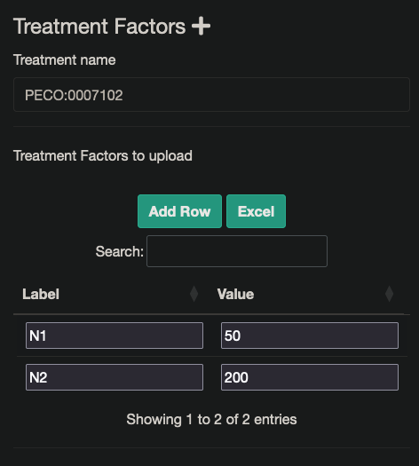

## Specifying the Plots

There is a [spreadsheet with some example plots ](example_plots.csv) that you can download to set up the Plots that you wish to submit for your Study.
There is more information on how to create and populate these spreadsheets in the [Submit Plot docs](https://grassroots.tools/documentation/field_trial/submit_plots.html). For a general overview, each Plot is specified 

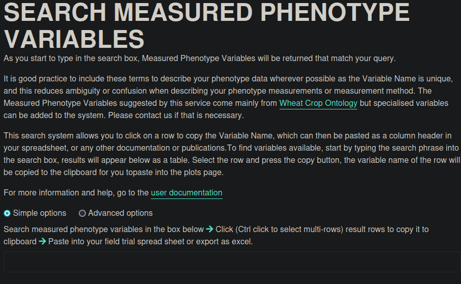

### Adding the phenotypic measurements

As well as some required columns, you can add as many columns for phenotypic values or treatments as you would like. 
The phenotypes are denoted by Measured Variables. 
We currently have over 1,000 specified within Grassroots and if the required ones are not available, it is trivial to add more so please get in touch if that is the case.
Rather than having to remember the phenotypes, we have a [search service](https://grassroots.tools/service/field_trial-search_measured_variables) where you can locate the ones that you would like easily.

So if we go to that page we're presented with something similar to the image below with a text

So let's find the Measured Variable for specifying the plant height in cm. 
If we start typing _height_ into the search box, the service will search for all terms that include the word height and will produce something like the image below. 
The term that we're searching for has been highlighted with the red box.

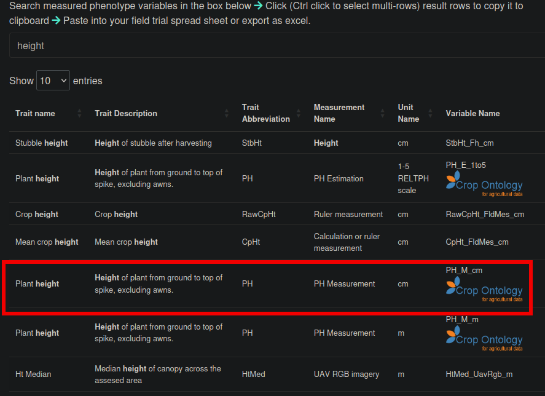

The column heading that we need is the value of the *Variable Name* which in this case is _PH\_M\_cm_.
So we need to put this as the first empty column heading in our spreadsheet. 
Note that the Measured Variable names are case-sensitive so make sure that you have the case correct. It should look something like the image below

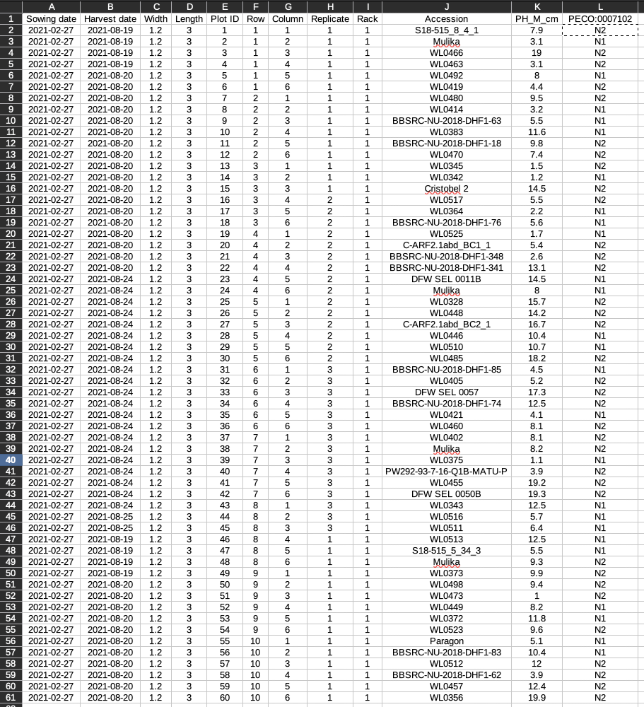

### Uploading the Plots spreadsheet

So now that we have the column heading set, we can go to the [Submit Plots](https://grassroots.tools/dev/service/field_trial-submit_plots) service and upload them. 
In the *Study* drop-down menu on that page, select the Study that you have been working. 
Once you have set it, drag and drop the Plots spreadsheet file that you shave filled in onto the box marked "Drop a spreadsheet file here to populate the table below".
Once this is done you should get the message 

~~~
File: example_plots.csv Processing done, ready to submit.
~~~

and see your uploaded plots similar to the image below.

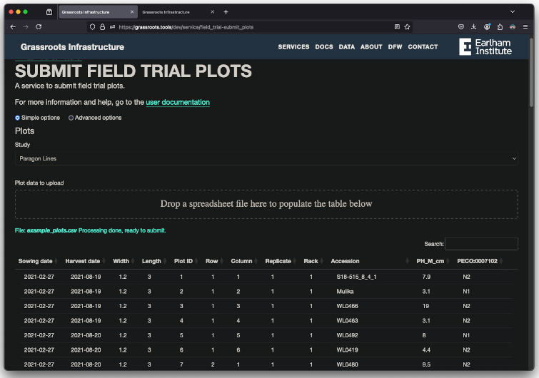

and if you scroll to the bottom of the page and click *Submit*, after a short while you should get a message saying `Done` and the link to view the Study. 

## Viewing the Study

Now that we have populated the Study's plots, we can view them in two ways. 

### Study-based view

The first is on the portal's Study page whose address was given when we submitted the Study. 
This should give you the map-based view with blue rectangles representing each of the Plots.
Clicking on any of the plots will give a pop-up with the information about that plot.
Below the map is a table where any of the Study's metadata that has been set is shown. 
As well as these, there are some additional links in the table that offer alternative ways of viewing the Study.

The first of these is *Download Frictionless Data Package*. [Frictionless Data Packages](https://frictionlessdata.io/) are an open format for storing and sharing data in a FAIR way and there is more information about how we use this in Grassroots [here](https://grassroots.tools/frictionless-data/).

Another link of interest is *Handbook pdf*. 
Grassroots collects the information for a Study and automatically generates a pdf available for download with the Study's information in it. 

In this table there is a link called _view plots_ and clicking on this will take you to a tabular-based view of your Study similar to the Plots-based view.

### Plots-based view

The Plots-based view is similar to the one shown below.

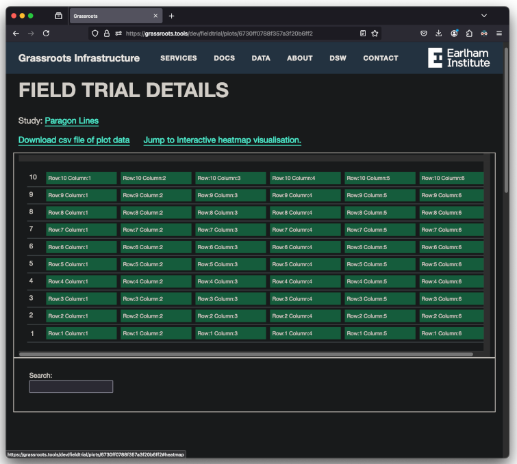

There are two links above the table. 
The first, *Download csv file of plot data*, lets users download a spreadsheet of the Plots data for this Study.
The second, *Jump to Interactive heatmap visualisation*, takes you to the phenotype heatmap view.

#### Phenotypic heatmap view

One of the ways that Grassroots takes advantage of using standard ontological terms is that it can automatically take advantage of knowing the type of data that these terms can store. 
Grassroots automatically identifies which terms store numeric values and then generates various statistical values for these. 
These include:

 * The minimum value
 * The maximum value
 * The mean value
 * The standard deviation

We can take advantage of these to present the information as graphical heatmaps for each of these numeric phenotypes. 
In our example here, our plant height phenotype is numeric and produces a heatmap similar to the one below

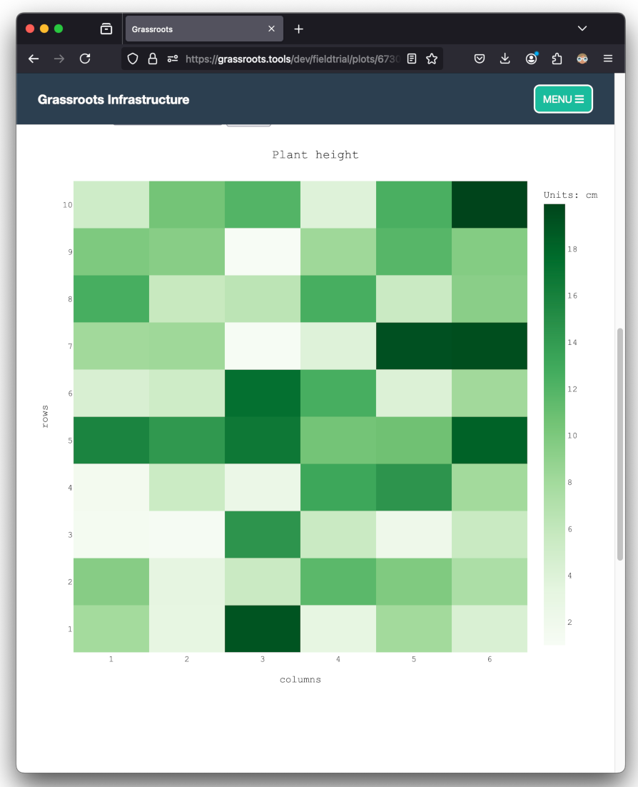

Each Plot in our study is represented by the corresponding rectangle in the heatmap. 
The colour of each of these denotes the Plot's value, ranging from light colours for the lower values to darker colours for the higher values. 
Hovering your cursor over any of these rectangles produces a pop-up showing the value along with some of the Plot's other metadata.

